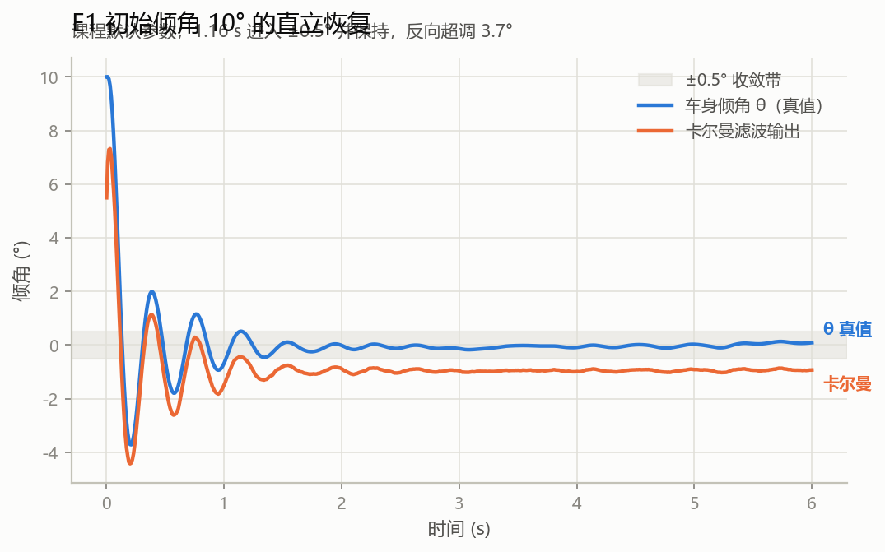
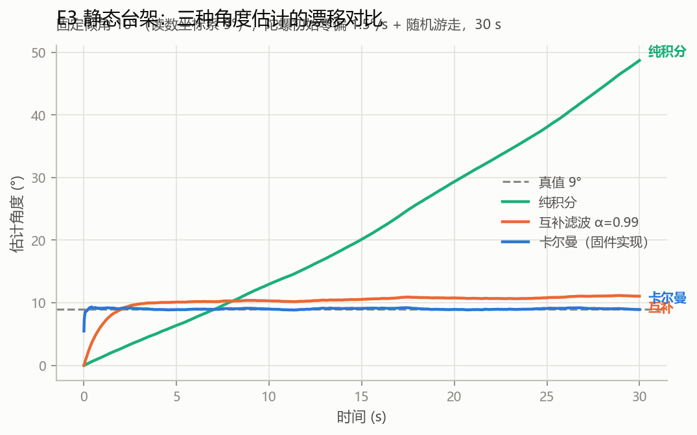
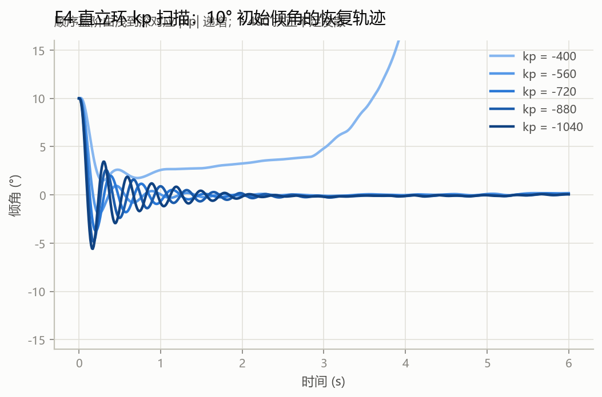
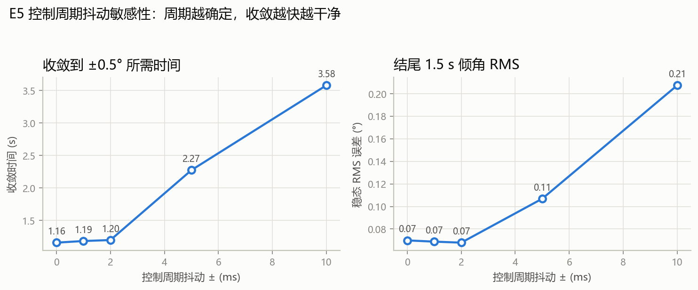

# 基于 STM32 + FreeRTOS 的两轮平衡车控制系统

> 两轮自平衡小车的嵌入式控制工程：**分层清晰、可在 PC 上单元测试、控制算法经固件在环（SIL）闭环验证**。
>
> **诚实边界**：当前无实物硬件。验证形态为 **主机侧单元测试 + 固件在环 SIL 仿真 + Keil 交叉编译 0 警告**；
> 未在真实小车上回归。仿真与实车的已知差异（摩擦、机械安装角、真实噪声谱）见 [docs/面试QA.md](docs/面试QA.md)。

## 1. 系统概览

| 项 | 选型 |
|---|---|
| 主控 | STM32F103C8T6（Cortex-M3, 72MHz, 20KB RAM） |
| RTOS | FreeRTOS（heap_4 15KB，tick 1ms） |
| 姿态 | MPU6050（I2C）→ 加速度倾角 + 陀螺角速度 → 一阶卡尔曼融合 |
| 速度 | 双路霍尔编码器（TIM 编码器模式，读取清零取增量） |
| 驱动 | TB6612FNG + 25GA-370 减速电机（TIM4 PWM，ARR=7199） |
| 人机 | 0.96" OLED（SPI）、ADC 电池电压、ECB01 蓝牙（USART2 遥控/调参） |

## 2. 代码分层

```
App/        应用编排：任务划分、采样→控制→显示调度、协议指令落地（零 HAL 调用）
Service/    纯 C 算法，零硬件依赖 → 同一份源码同时编进固件和 PC 测试
  ├── control_pid.*     三环 PID（直立 PD / 速度 PI / 转向 P）+ 三级限幅
  ├── attitude_kalman.* 二状态卡尔曼（倾角 + 陀螺零偏估计）
  └── protocol.*        串口帧协议状态机（遥控 + 在线调参，模糊测试友好）
Port/       硬件抽象接口（签名仅标准 C 类型），按实现二选一编译：
  ├── port_hal.c   实机：转发到 BSP/（Keil 工程使用）
  └── port_sim.c   仿真：倒立摆模型 + 传感器噪声（Host SIL 使用）★可测试性关键
BSP/        板级驱动（唯一允许包含 HAL 的业务代码）：imu / encoder / motor / adc / uart / oled
App/Car_Config.h   全局配置宏 + car_params_t 参数结构体（一处定义，多处引用）
Core/ drivers/     CubeMX 生成，只读
Host/       PC 侧：单元测试（CTest）+ SIL 闭环仿真 + 一键门禁脚本
tools/      上位机脚本：CSV 出图
```

**依赖方向**：`App → Service / Port`，`Port(port_hal) → BSP → HAL`；`Service` 不 include 任何 HAL/BSP 头文件。

## 3. 控制结构

```
                 ┌──────────────┐
  加速度倾角 ──→ │ 卡尔曼滤波    │──→ θ ──→ 直立环 PD ──┐
  陀螺角速度 ──→ │ (含零偏估计)  │                        │
  编码器增量 ──→ 速度环 PI ──────────────────────────→ 叠加限幅 → PWM×2 → TB6612
  gz 角速度 ───→ 转向环 P / 遥控差速 ─────────────────→  ↑
  遥控指令 ────→ 协议状态机 → 目标偏置
```

- **三环并联**：直立环 PD 出主扶正力矩（不用 I：积分会"追角度"过冲，稳态偏差由速度环吸收）；
  速度环 PI 修正长期跑偏；转向环 P 抑制 Z 轴自转，遥控转向时让位。
- **三级限幅**：单环输出 ±7199、速度环积分 ±10000、三环叠加后统一 ±7199（防写脏 TIM 寄存器 + 抗积分饱和）。

### 参数表（`g_car_params`，支持 `@PID,...#` 在线修改）

| 参数 | 含义 | 默认值 |
|---|---|---|
| `BKP` | 直立环 kp | -720 |
| `BKD` | 直立环 kd（原始陀螺值） | 0.72 |
| `BANG` | 目标平衡角（机械安装偏角） | -1.0° |
| `VKP` | 速度环 kp | 170 |
| `VKI` | 速度环 ki | 0.85 |
| `TKP` | 转向环 kp | 0.5 |
| — | PWM 限幅 / 积分限幅 / 倾角保护 | 7199 / 10000 / 45°(预留) |

## 4. 任务划分（FreeRTOS）

| 任务 | 优先级 | 触发 | 栈 | 职责 |
|---|---|---|---|---|
| `App_Task_PID` | **5（最高）** | 任务通知（采样完成） | 128 word | 三环控制 + PWM 输出 + 周期统计 |
| `App_Task_GetData` | 4 | `vTaskDelayUntil` 10ms | 128 word | IMU/编码器采样 → 通知 PID |
| `App_Task_Display` | 2 | `vTaskDelayUntil` 50ms | 128 word | OLED 刷屏（低优先级，不打断闭环） |
| `App_Task_Start` | 1 | 一次性 | 128 word | 临界区内创建任务后自删 |

控制链路优先级 > 显示链路，OLED 全屏 SPI 刷新不再造成控制周期抖动。
PID 任务内置**周期统计**（相邻两次唤醒间隔 min/max，10s 打印一次到 USART1）。

## 5. 串口协议（USART2 / 蓝牙）

| 帧 | 含义 | 示例 |
|---|---|---|
| `@MV,x#` | 前后：U/D/S | `@MV,U#` 前进 |
| `@TR,x#` | 转向：L/R/S | `@TR,L#` 左转 |
| `@PID,NAME,val#` | 在线调参 | `@PID,BKP,-700.0#` |
| `@ST#` | 状态输出（延迟到任务上下文打印） | 角度/电压/周期/栈水位/参数/CPU |
| 裸字符 `U/D/L/R/S` | 兼容手机蓝牙串口助手的单字符习惯 | `U` |

健壮性：半包/二进制垃圾/超长帧/字段截断一律丢帧自愈，经 10 万字节模糊测试。

## 5.1 安全与可观测性机制

| 机制 | 实现要点 | 验证 |
|---|---|---|
| 倾角保护 | **锁存式**：越 45° 切断并清控制状态；"接近直立 + 车身静止"持续 0.5s 才解锁。不能用电平式——翻滚时加速度角 `atan2` 回绕会让融合角在阈值附近抖动反复启停（SIL E6 首版实测到的失效） | SIL **E6** |
| 欠压降功率 | 9.6V 进入 / 10.2V 退出（迟滞），PWM 限幅减半，ADC 归控制任务独占 | SIL **E7**（9.0V → max\|pwm\|=3599） |
| 独立看门狗 | IWDG 约 2.56s 超时，控制任务每周期喂狗；卡死即硬件复位 | 编译验证（需实机） |
| 参数并发保护 | 中断侧解析 → 待写槽位 → 控制任务临界区消费（mutex 不能进中断，这是选临界区的原因） | 编译验证 + 单测 |
| 栈水位 / CPU 占用 | `uxTaskGetStackHighWaterMark` + DWT 周期计数驱动的 FreeRTOS 运行时统计，`@ST#` 一键输出 | 编译验证（需实机看数据） |

## 6. 验证体系（无硬件的完整证据链）

| 层 | 手段 | 结果 | 产物 |
|---|---|---|---|
| 编译 | Keil MDK 全量重编译 | **0 Error / 0 Warning** | `MDK-ARM/CAR_HAL.uvprojx` |
| 静态 | cppcheck（App/Service/Port/BSP/Host） | 0 告警 | `Host/run_checks.sh` |
| 单元测试 | CMake + gcc `-Werror` + CTest，114 断言 | 3/3 全绿 | `Host/tests/` |
| 覆盖率 | gcov（`Service/` 行覆盖） | **98.54%**（attitude 100% / control 100% / protocol 97.7%） | `CAR_COVERAGE=ON sh run_checks.sh` |
| 闭环 | **固件在环 SIL**：倒立摆模型 + 同一份 App/Service 源码 | **7/7**（E1/E2/E6/E7 进 CTest 门禁） | `Host/sim/` |

### SIL 实验结果（`Host/sim/main_sil.c --check`，图见 [docs/sil/](docs/sil/)）

| 实验 | 内容 | 结果 | 验收 |
|---|---|---|---|
| E1 | 初始倾角 10° 直立恢复 | 1.16s 进入 ±0.5°，超调 3.72°，稳态 RMS 0.070° | ✅ ≤3s |
| E2 | t=2s 施加 0.3 m/s 速度冲击 | 1.22s 恢复 | ✅ ≤2s |
| E3 | 台架 30s：卡尔曼 vs 互补 vs 纯积分 | RMS **0.091° / 1.877° / 30.0°** | ✅ 卡尔曼最优 |
| E4 | `balance_kp` 扫描 -400~-1040 | -400 发散；超调 1.96°→5.59° 单调上升 | ✅ 趋势成立 |
| E5 | 控制周期抖动 0/1/2/5/10ms | 收敛 1.16→3.58s、RMS 0.070→0.207 单调劣化 | ✅ 周期确定性有价值 |
| E6 | 60° 倒地：倾角锁存保护 | 0.5s 后 PWM 恒 0（翻滚中不解锁） | ✅ 进 CTest |
| E7 | 9.0V 欠压 | 全程 max\|pwm\|=3599（半量程），电压读数正确 | ✅ 进 CTest |






> 仿真模型参数（质量/电机常数/阻尼）按公开规格估算，并以"默认 PID 增益在
> 10° 初始倾角下收敛"为约束做过网格标定（依据见 `Host/sim/pendulum_model.h`）。
> 结论只支撑**趋势与相对比较**，不声称绝对精度——这是无实物验证的诚实边界。

## 7. 复现步骤

```bash
# Host 一键门禁：cppcheck + 单元测试 + SIL 实验
cd Host
sh run_checks.sh                  # Windows: Git Bash / WSL
CAR_COVERAGE=ON sh run_checks.sh  # 附带 gcov 覆盖率报告

# 单独跑仿真 / 出图（E1~E7 共 7 组实验）
./build/sil_sim all build/sim_out --check
python ../tools/plot.py build/sim_out ../docs/sil

# 固件
# Keil MDK 打开 MDK-ARM/CAR_HAL.uvprojx 全量编译（或 UV4 -b）
```

## 8. 资料与文档

- [docs/面试QA.md](docs/面试QA.md) —— 高频追问与答案要点
- [docs/问题清单.md](docs/问题清单.md) —— 14 项缺陷的定位与修复过程（讲故事素材）
- [docs/sil/](docs/sil/) —— 仿真曲线与数据
